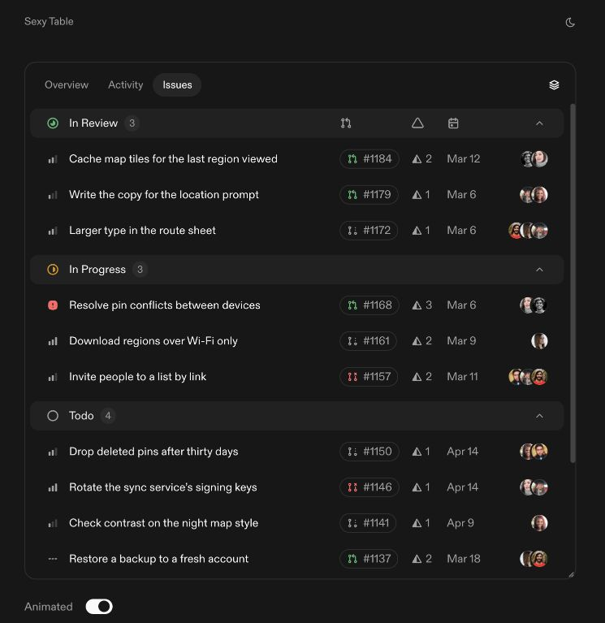
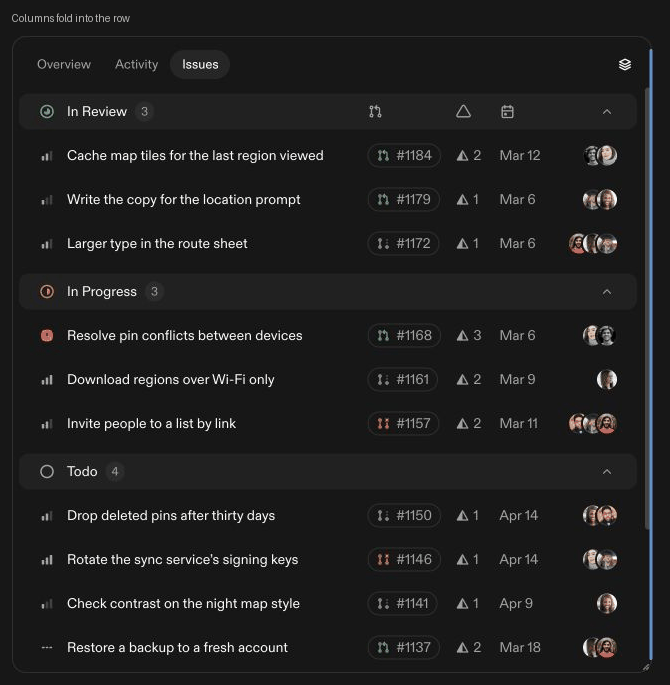

# Sexy Table

A TypeScript React table with responsive columns, animated layouts, avatar stacks, collapsible groups, and optional resizing. Supports React 18.3 and 19, ESM and CommonJS, light and dark themes, and reduced motion.

## Install

Download the archive from the [latest release](https://github.com/aaarnv/sexy-table/releases/latest), then install it in your app:

```sh
npm install ./aaarnv-sexy-table-0.2.0.tgz
```

The package is distributed through GitHub releases. To build it yourself, run `npm ci` and `npm pack`.

## Use

```tsx
import { SexyTable, SexyTableStatusIcon } from "@aaarnv/sexy-table";
import type { SexyTableGroup } from "@aaarnv/sexy-table";
import "@aaarnv/sexy-table/styles.css";

const groups: readonly SexyTableGroup[] = [
  {
    id: "backlog",
    label: "Backlog",
    icon: <SexyTableStatusIcon status="todo" />,
    issues: [
      { id: "issue-1", title: "Ship the new dashboard", priority: "high" },
    ],
  },
];

export function Issues() {
  return <SexyTable groups={groups} theme="dark" />;
}
```

Supply your own data, toolbar, font, and avatar URLs. Import the CSS once in your application. [API documentation](docs/api.md) covers all fields, callbacks, themes, sizing, and the `SlidingTabs` toolbar.



<details>
<summary>Watch the responsive animation</summary>



</details>

## Develop

```sh
npm ci
npm run dev
```

The library lives in `src/`, the demo in `src/demo/`, and installed-package examples in `tests/consumer/`.

| Command                 | Purpose                                                         |
| ----------------------- | --------------------------------------------------------------- |
| `npm run build:lib`     | Build the library in `dist/lib`                                 |
| `npm run build:demo`    | Build the demo and Sites worker                                 |
| `npm run build`         | Build both                                                      |
| `npm run typecheck`     | Check strict TypeScript types                                   |
| `npm run lint`          | Check code style and hooks                                      |
| `npm run format:check`  | Check formatting                                                |
| `npm run test:package`  | Check exports, SSR, and distribution contents after building    |
| `npm run test:consumer` | Build and server-render installed packages with React 18 and 19 |
| `npm run test:sites`    | Check the Sites worker                                          |
| `npm pack`              | Build an installable library archive                            |

GitHub Actions runs these checks for pushes and pull requests. See [verification](docs/verification.md) for the reference comparison and browser checks.

## Attribution

The design follows the publicly rendered [Kobra grouped-table preview](https://kobra.systems/components/grouped-table). The implementation uses Base UI for collapsible panels, scroll areas, and tooltips. SVG marks include Tabler icons and simple status and priority shapes observed in the reference. No paid component source or registry access was obtained.

The demo includes captured ABC Diatype font and avatar photos from Pravatar and Kobra's preview. Those assets retain their owners' rights and are excluded from the library archive. Use your own licensed font and photos when distributing the demo.
