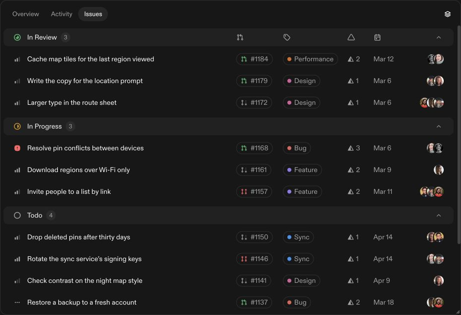

# Grouped Table

A standalone React recreation of the [Kobra grouped-table preview](https://kobra.systems/components/grouped-table), written independently using the rendered DOM, styles, assets, and observations of its publicly served runtime. No paid component source or registry access was obtained.




## Run

```sh
npm install
npm run dev
```

`npm run build` produces the app in `dist/client`. `npm run preview` serves the production build.

## Component

```jsx
import { GroupedTable } from './src/GroupedTable.jsx';
import { initialGroups } from './src/data.js';

<GroupedTable
  groups={initialGroups}
  toolbar={<div>Your toolbar</div>}
  animated
  resizable
  onAdd={status => console.log(status)}
/>
```

Each group has `status`, `icon`, and `issues`. See `src/data.js` for the schema and the 13 reference issues. The component uses `@base-ui/react` for collapsible panels, scroll areas, and tooltips. Copy `GroupedTable.jsx`, its two hooks, `grouped-table.css`, and the referenced assets together. `SlidingTabs.jsx` implements the demo toolbar. Theme variables are defined in `src/styles.css`.

- Container queries at 39.5rem and 47.5rem. Narrow rows scroll horizontally.
- Hierarchical FLIP with the reference's 460ms glide, row and field staggering, independently animated avatar fans, and label/glyph entrance and exit transitions.
- Interruptible resize transitions retain their current translation. Ordinary resize observations do not finish active animations.
- Base UI panels animate height for 200ms and remove closed contents after the transition.
- Sticky group headers and custom overlay scrollbars.
- Width, height, and corner dragging. Arrow keys resize by 16px; Home selects the minimum, End restores the natural dimension. Double-click an edge or corner to reset it.
- Reduced-motion support and an Animated switch outside the table.

The tabs change selection while keeping the table visible. Add and View options are demo no-ops, matching the reference. Supply `onAdd` when integrating the component into an application.

## Verification

[Design QA](design-qa.md) records the desktop/mobile comparisons, actual browser interactions, and motion measurements. The GIF above consists of screenshots captured from the running local app. It demonstrates both directions of the responsive transition; it is not a synthetic animation.

## Assets and attribution

The demo uses locally captured SVG marks, the ABC Diatype regular font, and sample avatar photos loaded by the reference. These assets retain their owners' rights and are not relicensed by this repository. ABC Diatype is a commercial font; use a licensed font before distributing the demo. Avatar photos come from Pravatar and Kobra's preview image. No Kobra subscription, paid source files, registry access, or backend is included.
